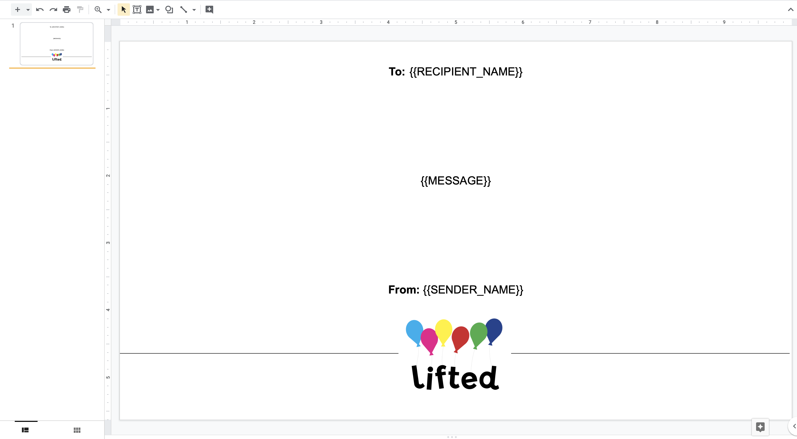

# sheets2slides
A tool to take Google Sheets data and create Google Slides based on an existing template.

# Prerequisites

## Download & Setup

1. Make sure you have **npm** and **Node.js** installed! npm is installed with Node.js, so you can nab both by downloading the LTS (Long Term Support) Node.js version [**here**](https://nodejs.org/en/).
2. Under Step 1 on Google's Node.js [Quick Start Guide](https://developers.google.com/slides/quickstart/nodejs), click **Enable the Google Slides API** for your Google account. When you are finished, make sure you **Download Client Configuration**. This will download a file called `credientials.json` that you will need to run the script.

>Note: Make sure the Google account you use has access to the spreadsheets and presentations you will be using!

## Required Google Documents

### Presentation

This script requires an existing Google Slides presentation with a pre-made template slide. The first slide in the presentation will be used as a **template**, and generated slides will be added to the end of the presentation. Your template slide should have tokens on them, or unique strings that will be replaced by actual data. See **Files** under **Customization** for more information.

**Example Template** • [Example Google Slides Document](https://docs.google.com/presentation/d/1WecOJ0-4SowO9R2hyPH8DHO8kf6vzm8X7hH_pN4IEPM/edit?usp=sharing)



In this example, "To:" and "From:" would not be changed and remain in the generated slides.

### Spreadsheet

This script requires an existing Google Sheets spreadsheet with existing data.

# Installation

1. [Download](https://github.com/mattbarker016/sheets2slides/archive/master.zip) or clone this repository.
2. Open Terminal / Command Prompt. Type `cd`, then one space, and then drag the folder into the window to copy the file path. Hit Enter.
3. Run `npm install` to install dependencies used.
4. If you have everything configured properly, run `node sheets2slides.js`. See **Customizations** for more information.

## Token Generation & Permissions

If this is your first time running the script, or your token has expired, you will need to generate an access token to use Google's APIs. On executing the script, your browser will open to a Google sign-in page, where you will grant access for the script to use APIs modifying data in Google Sheets and Google Slides. Then, copy the generated code in your browser in the Terminal / Command Prompt window and hit enter. The script will continue as normal.

# Customization

Open `sheets2slides.js` in your favorite text editor to add your documents and customize options at the top of the file.

## Files (Required)

- **`spreadsheetID`**: The identifier of the spreadsheet used for data. This is the long string of text between (or after) "spreadsheets/d/" and "/edit" in the spreadsheet URL.
- **`sheetName`**: The name of the specific sheet with the data, which appears on the bottom of the spreadsheet. This is different from the spreadsheet file name.
- **`presentationID`**: The identifier of the template presentation. This is the long string of text between (or after) "presentation/d/" and "/edit" in the spreadsheet URL.

## Data Mapping (Required)

**`sheets2SlidesDictionary`** is the bridge between a spreadsheet and a presentation. The ***key*** of the dictionary (right side of the colon) should be a string corresponding to the column of the data in the spreadsheet. The ***value*** of the dictionary (left side of the colon) is the token, or unique string, that will be replaced by the spreadsheet data. 

For example, let's say you have a spreadsheet with names and want to add someone's first name to a slide. You could add **"{{FIRST_NAME}}"** in a text box to your template slide wherever you want someone's first name to appear. Then, you would make the *key* be **"A"**, where **"A"** is the letter of the column corresponding to first names, and make the *value* be the token **"{{FIRST_NAME}}"**.

**Example**
```
var sheets2SlidesDictionary = {

    "A": "{{FIRST_NAME}}",

    "B": "{{LAST_NAME}}",

    "C": "{{HOMETOWN}}"
    
}
```

>Note: Make sure you add a comma after every line, *except* for the last one!

## Other

You can modify the range of data you query from the spreadsheet. By default, the data spans from columns A-Z and rows 1-1000. You can leave these only because the script ignores empty rows.

# Troubleshooting

- Try reading the console output for an indication of the error. Sometimes you can figure out if you made a typo!
- If you run into network request issues that don't make sense, try deleting `token.json` and re-creating a new token.
- Don't hesitate to message me on Slack or email mjb485@cornell.edu!

